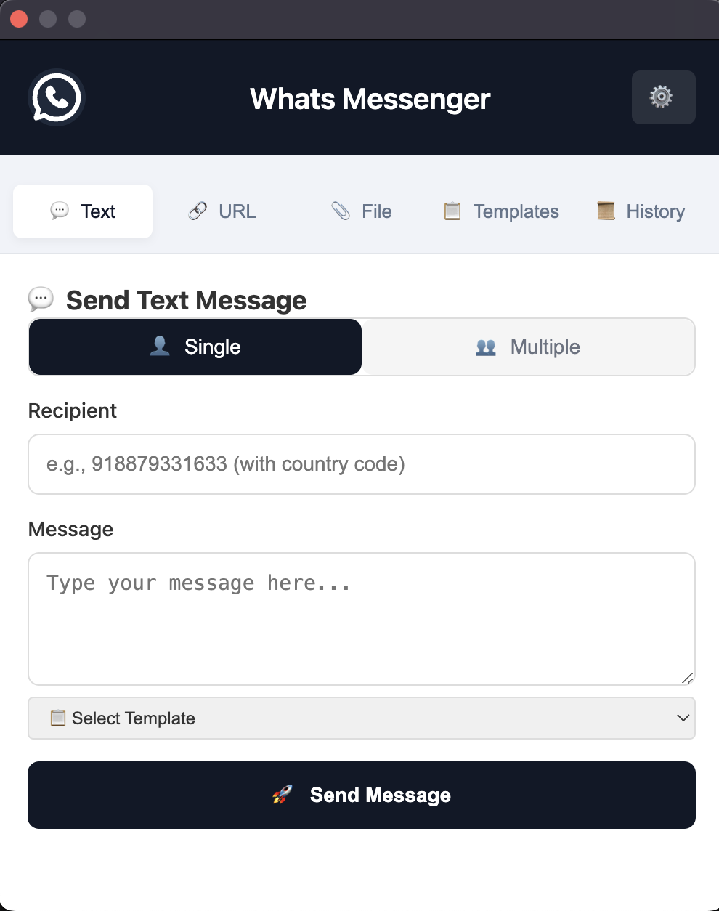
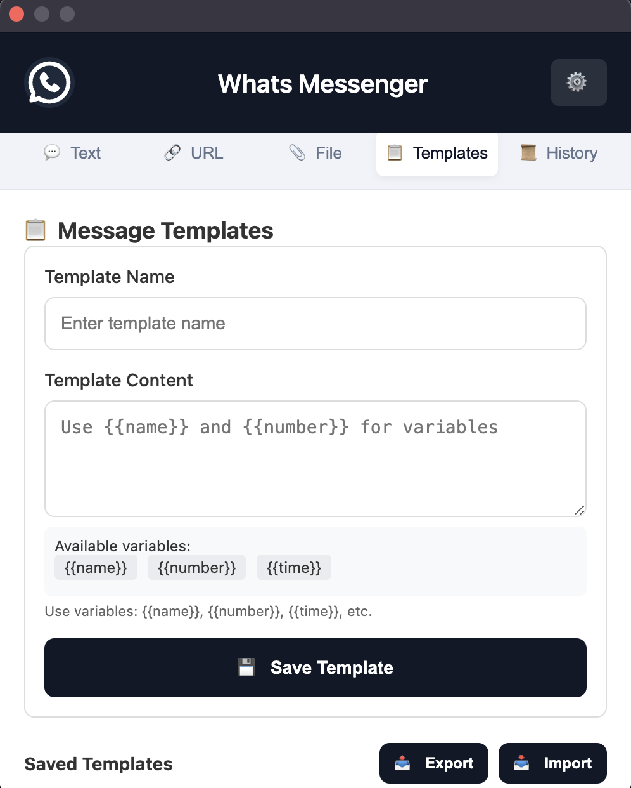
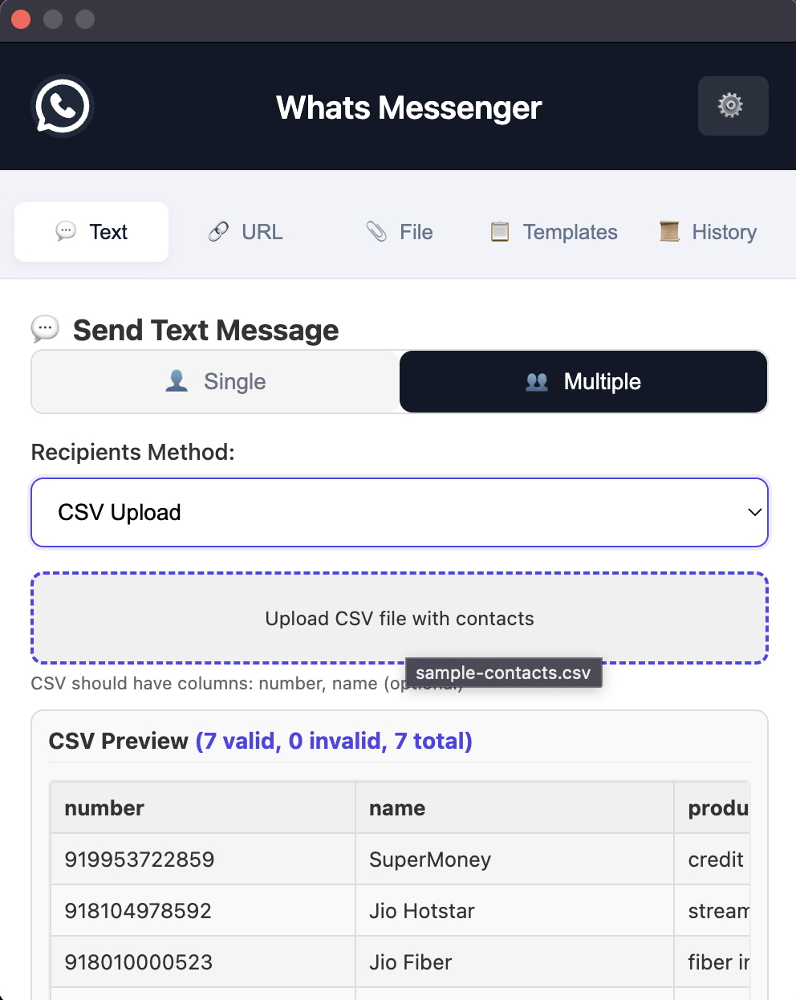
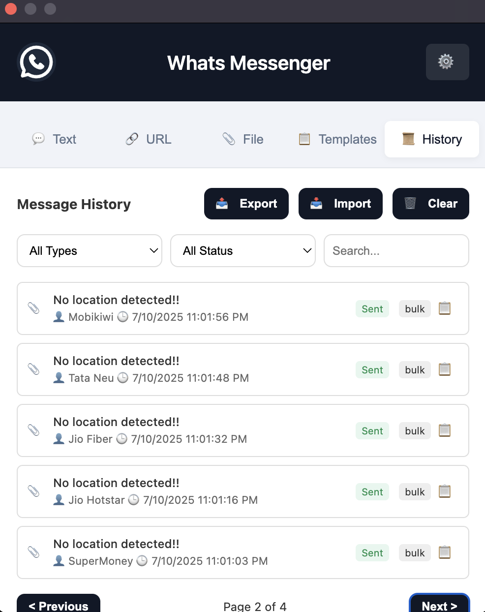

# Whats Messenger

A powerful Chrome extension for sending WhatsApp messages directly from your browser with advanced features like templates, bulk messaging, CSV integration, and smart delays.

> **Note:** This project is built on top of [whatsapp-web-interaction-suite](https://github.com/naranarethiya/whatsapp-web-interaction-suite). Special thanks to the original team for their excellent foundation.

## Screenshots

<!-- Screenshots -->
<table>
  <tr>
    <td></td>
    <td></td>
    <td></td>
    <td></td>
  </tr>
  <tr>
    <td align="center">Main Interface</td>
    <td align="center">Template Management</td>
    <td align="center">CSV Upload</td>
    <td align="center">History</td>
  </tr>
</table>

## Features

### 📱 Message Types
- **Text Messages**: Send simple text messages
- **URL Media**: Send images, videos, or other media via URL
- **File Upload**: Send local files (images, videos, documents, etc.)

### 👥 Recipient Options
- **Single Contact**: Send to individual recipients
- **Multiple Contacts**: Send to multiple recipients at once
- **CSV Upload**: Import contacts from CSV files with validation

### 📋 Templates
- **Template Management**: Create, edit, and delete message templates
- **Variable Support**: Use variables like {{name}}, {{number}}, {{time}}
- **CSV Column Variables**: Use any column from your CSV as a variable

### 📊 History & Analytics
- **Message History**: Track all sent messages
- **Export/Import**: Export history as CSV or JSON
- **Filtering**: Filter history by type, status, and search terms

### ⚙️ Advanced Settings
- **Smart Delays**: Add random time gaps between messages (5-600 seconds)
- **Batch Pausing**: Automatically pause after sending a batch of messages
- **Sleep Prevention**: Keep your device awake during long campaigns

## Installation

1. **Install from Chrome Web Store**: (Link to be added)
2. **Open WhatsApp Web**: Navigate to [web.whatsapp.com](https://web.whatsapp.com) and log in
3. **Open Extension**: Click the extension icon in your browser toolbar

## How to Use

### Sending Text Messages
1. Open the extension popup
2. In the "Text" tab, enter the recipient's number with country code (e.g., 918879331633)
3. Type your message
4. Click "Send Message"

### Sending Media
1. Select the "URL" or "File" tab
2. Enter the recipient's number
3. Provide the media URL or upload a file
4. Add an optional caption
5. Click "Send URL" or "Send File"

### Using Templates
1. Go to the "Templates" tab
2. Create templates with variables like {{name}}, {{number}}, {{time}}
3. When composing a message, select a template from the dropdown
4. Variables will be replaced with actual values when sending

### Bulk Messaging with CSV
1. Select "Multiple" in any message tab
2. Choose "CSV Upload" as the recipients method
3. Upload your CSV file (must contain a column for phone numbers)
4. Preview the data and confirm valid contacts
5. Compose your message using CSV column names as variables: {{columnname}}
6. Configure delay settings in the Settings tab
7. Send your message

## CSV Format Requirements

Your CSV file should include at least one column for phone numbers (labeled as number, phone, mobile, or contact). Additional columns can be used as variables.

Example:
```csv
number,name,company,product
918879331633,John Doe,ABC Corp,Premium Plan
917012345678,Jane Smith,XYZ Inc,Basic Plan
```

In your message, you can use `{{name}}`, `{{company}}`, and `{{product}}` as variables.

## Developer API

For developers looking to integrate with this extension programmatically:

### Modern Promise-based API (Recommended)

```javascript
// Send text message
try {
    const response = await window.whatsappWebSuite.sendTextMessage(mobile, message);
    console.log('Message sent successfully:', response);
} catch (error) {
    console.error('Failed to send message:', error);
}

// Send media from URL
try {
    const response = await window.whatsappWebSuite.sendUrlMediaMessage(mobile, url, caption);
    console.log('Media sent successfully:', response);
} catch (error) {
    console.error('Failed to send media:', error);
}

// Send file (Base64)
try {
    const response = await window.whatsappWebSuite.sendBase64Message(
        mobile,      // Mobile number with country code
        base64Data,  // Raw base64 data
        mimeType,    // e.g., 'image/jpeg', 'video/mp4'
        filename,    // Display filename
        caption      // Optional caption
    );
    console.log('File sent successfully:', response);
} catch (error) {
    console.error('Failed to send file:', error);
}
```

## Best Practices

- **Add Delays**: Use the random delay feature to avoid being flagged as spam
- **Batch Processing**: For large campaigns, use the batch pause feature
- **Test First**: Always test your templates and CSV files with a small group
- **Personalize**: Use variables to create personalized messages
- **Respect Privacy**: Only send messages to contacts who have agreed to receive them

## Important Notes

- **WhatsApp Web Required**: Keep WhatsApp Web open and logged in
- **Number Format**: Always include the country code (e.g., 918879331633 for India)
- **Media Support**: Supports images, videos, documents, and audio files
- **File Size Limit**: Maximum file size is 16MB
- **CSV Validation**: The extension validates phone numbers in your CSV

## Acknowledgements

- Built on top of [whatsapp-web-interaction-suite](https://github.com/naranarethiya/whatsapp-web-interaction-suite)
- Uses [whatsapp-web.js](https://github.com/pedroslopez/whatsapp-web.js) for WhatsApp Web interaction

## License

This project is licensed under the MIT License - see the LICENSE file for details.